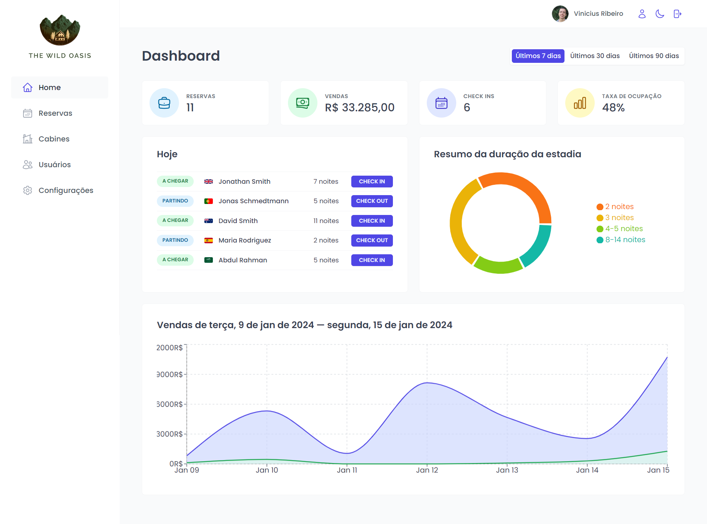

# The Wild Oasis 🏨

<h3>🙋🏻‍♀️ Contextualização</h3>

<ul>
    <li>“The Wild Oasis” é um pequeno <strong>hotel</strong> boutique com 8 luxuosas cabanas de madeira.
    </li>
    <li>Eles precisam de um aplicativo personalizado para gerenciar tudo sobre o hotel:<strong> reservas, cabines e
            hóspedes.</strong>
    </li>
    <li>Este é o <strong>aplicativo interno</strong> usado dentro do hotel para fazer check-in dos hóspedes
        <strong>assim que eles chegarem</strong>.
    </li>
    <li>Eles não têm nada agora, então também precisam de uma API.
    </li>
    <li><strong>Mais tarde</strong>, eles provavelmente vão querer um website de atendimento voltado para os clientes
        também, onde eles poderão reservar estadias, usando a mesma API.
    </li>

</ul>

<h3>🛠️ Tecnologias Utilizadas</h3>

<ul>
    <li>React </li>
    <li>React Router</li>
    <li>Styled Components</li>
    <li>React Query</li>
    <li>Context API</li>
    <li>React Hook Form</li>
    <li>Outros: Supabase, recharts, date-fns, react icons, etc...</li>
</ul>

<h3>❗ATENÇÃO❗</h3>

➡️ Se você deseja testar o projeto <strong>é preciso ter uma conta criada para acessar a plataforma.</strong> Se essa for a sua vontade, envie um email para viniciusgoes159@gmail.com solicitando um login e senha. 😉

<h3>🎯 Requisitos:</h3>

<table>
    <thead>
        <tr>
            <th>Categoria</th>
            <th>Requisitos</th>
        </tr>
    </thead>
    <tbody>
        <tr>
            <td>Autenticação</td>
            <td>
                <ol>
                    <li>✅Os usuários do aplicativo são funcionários do hotel. Eles precisam estar logados no aplicativo
                        para realizar tarefas.</li>
                    <li>✅Novos usuários só podem ser cadastrados dentro dos aplicativos (para garantir que apenas
                        funcionários reais do hotel possam obter contas).</li>
                    <li>✅Os usuários devem poder fazer upload de um avatar e alterar seu nome e senha.</li>
                </ol>
            </td>
        </tr>
        <tr>
            <td>Cabines</td>
            <td>
                <ol>
                    <li>✅O aplicativo precisa de uma tabela com todas as cabines, mostrando a foto da cabine, nome,
                        capacidade, preço e desconto atual.</li>
                    <li>✅Os usuários devem poder atualizar ou excluir uma cabine e criar novas cabines (incluindo o
                        upload de uma foto).</li>
                </ol>
            </td>
        </tr>
        <tr>
            <td>Reservas</td>
            <td>
                <ol>
                    <li>✅O aplicativo precisa de uma tabela com todas as reservas, mostrando datas de chegada e saída,
                        status e valor pago, bem como dados da cabine e dos hóspedes.</li>
                    <li>✅O status da reserva pode ser “não confirmado” (reservada mas ainda não com check-in), “check-in”
                        ou “check-out”. A tabela deve ser filtrável por este importante status.</li>
                    <li>✅Outros dados de reserva incluem: número de hóspedes, número de noites, observações dos hóspedes,
                        se reservaram o pequeno-almoço, preço do pequeno-almoço.</li>
                </ol>
            </td>
        </tr>
        <tr>
            <td>Check-in / Out</td>
            <td>
                <ol>
                    <li>✅Os usuários devem poder excluir, fazer check-in ou check-out de uma reserva assim que o hóspede
                        chegar (sem necessidade de edição por enquanto).</li>
                    <li>✅As reservas podem ainda não ter sido pagas na chegada do hóspede. Portanto, no check in, o
                        usuário precisa aceitar o pagamento (fora do app), e em seguida, confirme se o pagamento foi
                        recebido (dentro do aplicativo).</li>
                    <li>✅No momento do check in, o hóspede deverá ter a possibilidade de adicionar café da manhã para
                        toda a estadia, caso ainda não o tenha feito.</li>
                </ol>
            </td>
        </tr>
        <tr>
            <td>hóspedes</td>
            <td>
                <ol>
                    <li>✅Os dados do hóspede devem conter: nome completo, e-mail, documento de identidade nacional,
                        nacionalidade e bandeira do país para fácil identificação.</li>
                </ol>
            </td>
        </tr>
        <tr>
            <td>Dashboard</td>
            <td>
                <ol>
                    <li>✅A tela inicial do aplicativo deve ser um painel, para exibir informações importantes dos últimos
                        7, 30 ou 90 dias:</li>
                    <ol>
                        <li>✅Uma lista de hóspedes que farão check-in e check-out no dia atual. Os usuários devem ser
                            capazes de realizar essas tarefas aqui.</li>
                        <li>✅Estatísticas sobre reservas recentes, vendas, check-ins e taxa de ocupação.</li>
                        <li>✅Um gráfico que mostra todas as vendas diárias do hotel, mostrando tanto as vendas “totais”
                            como as vendas “extras” (apenas café da manhã no momento).</li>
                        <li>✅Um gráfico que mostra estatísticas sobre a duração da estadia, pois esta é uma métrica
                            importante para o hotel.</li>
                    </ol>
                </ol>
            </td>
        </tr>
        <tr>
            <td>Configurações</td>
            <td>
                <ol>
                    <li>✅Os usuários devem ser capazes de definir algumas configurações em todo o aplicativo: preço do
                        café da manhã, mínimo e máximo de noites/reserva, máximo de hóspedes/reserva.</li>
                </ol>
            </td>
        </tr>
        <tr>
            <td>Outros</td>
            <td>
                <ol>
                    <li>✅O aplicativo precisa de um modo escuro.</li>
                </ol>
            </td>
        </tr>
    </tbody>
</table>
